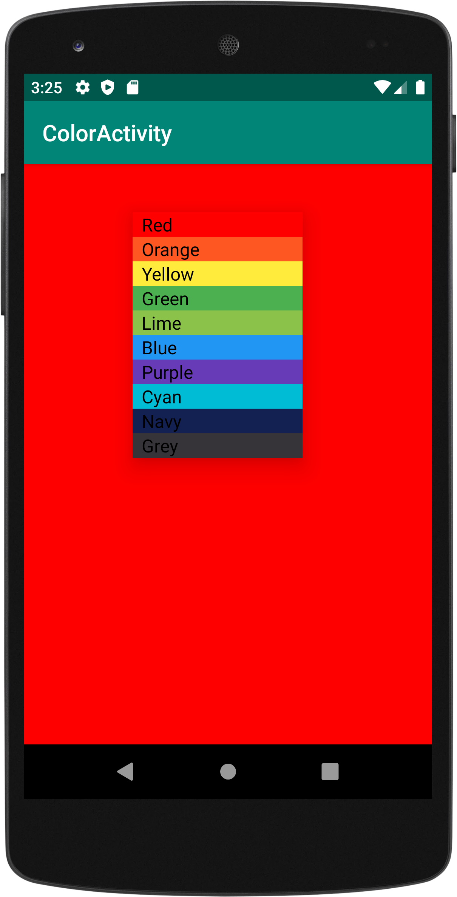
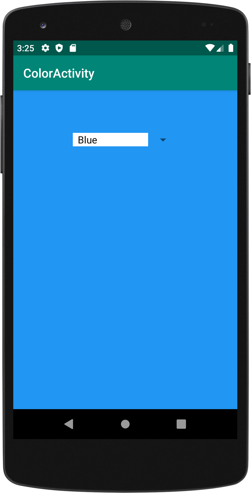
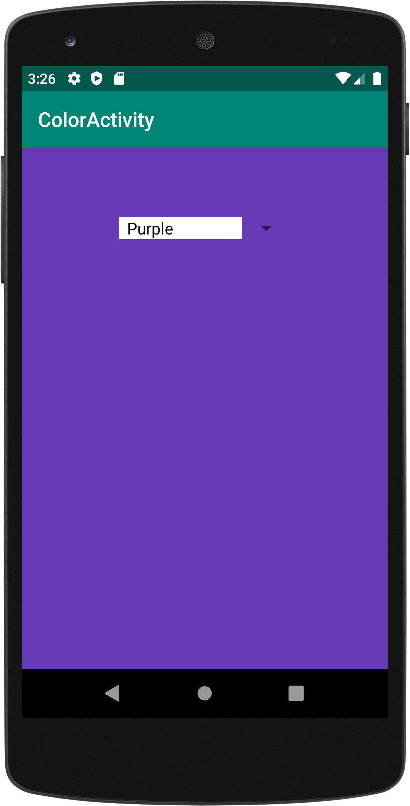

# Color Activity (Using ListView) - CIS 3515

**Assignment 3**

This was the third assignment I worked on for my CIS 3515 - Introduction to Mobile Application Development course. 
The application was made to practice using ListViews.

- Application displays a ListView containing different color options. The background of the entire application 
will change to the color the user has selected. If the user changes their selection to a different color, the 
background color will change accordingly.
 

     
